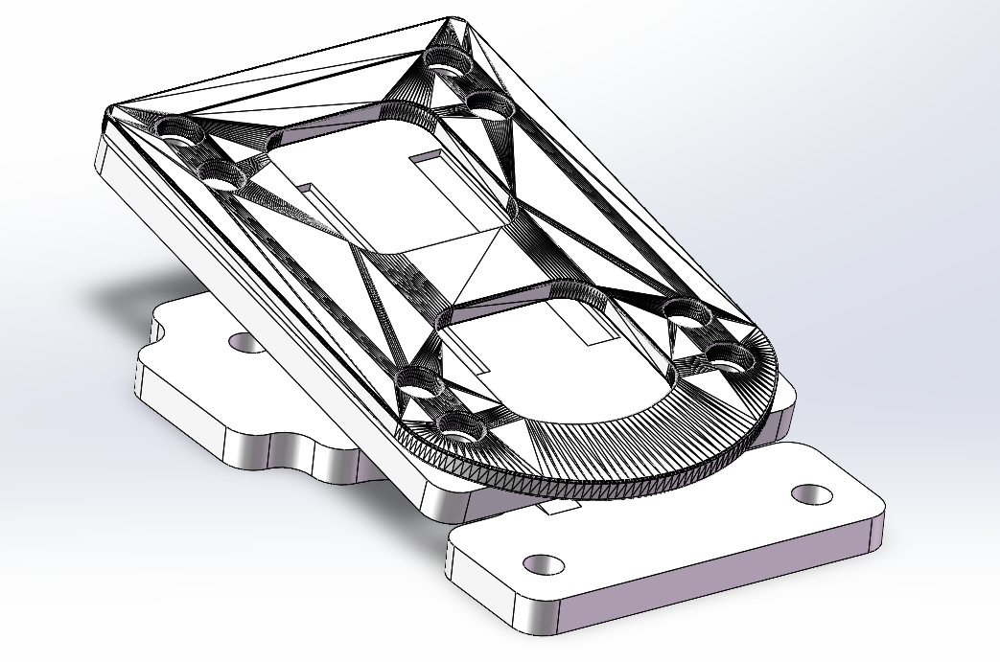
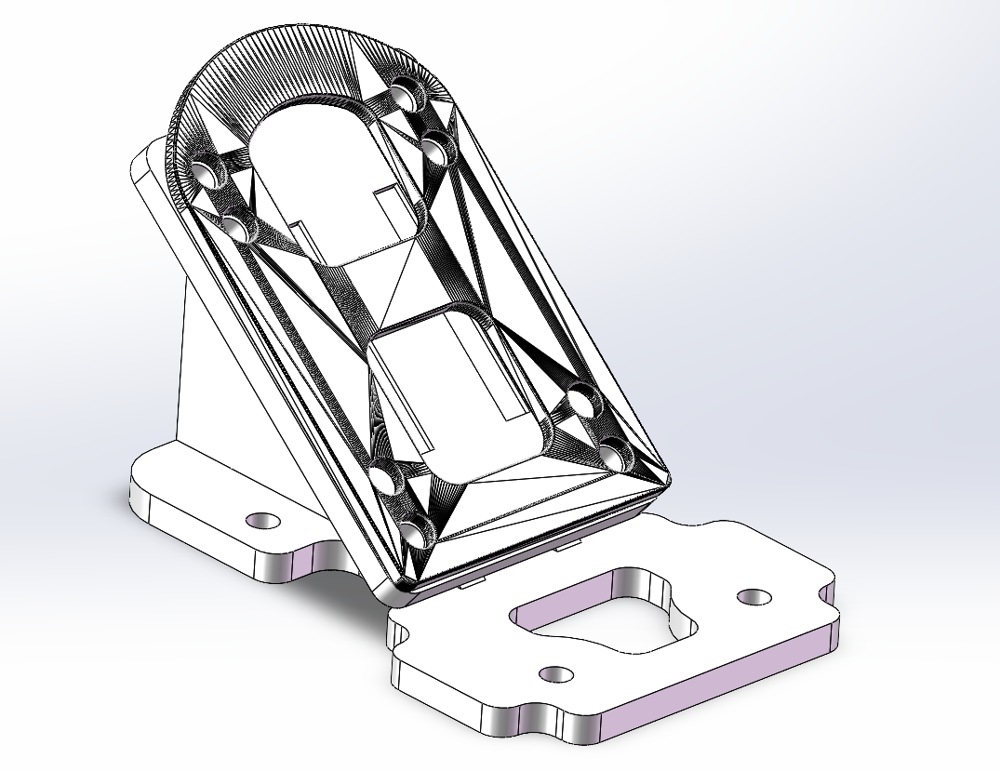

# LDP专用斜垫片

&emsp;&emsp;分别为前桥和后桥设计的垫片，适用于轴距35~38英寸长的板面。只适用于50°的RKP桥（已使用Paris V3进行测试），可以把50°的RKP桥分别改到60°和10°，并保持桥杆高度一致

## 装配体

## 加工注意事项

- 板材厚度**必须**略微超出5mm，否则无法实现**过盈配合**

- 垫片与腹板配合形成的凹槽处需要被**焊接**，安全起见最好是**全焊焊接**

## 装配注意事项

- 如果滑板板面厚15mm，那么需要20mm、30mm长外六角M5螺丝

- 1~2mm厚，外径10mm，M5垫圈

- 先装配滑板桥，后装配斜垫片

## 维护注意事项

- 螺丝松动可以使用开口扳手来拧紧